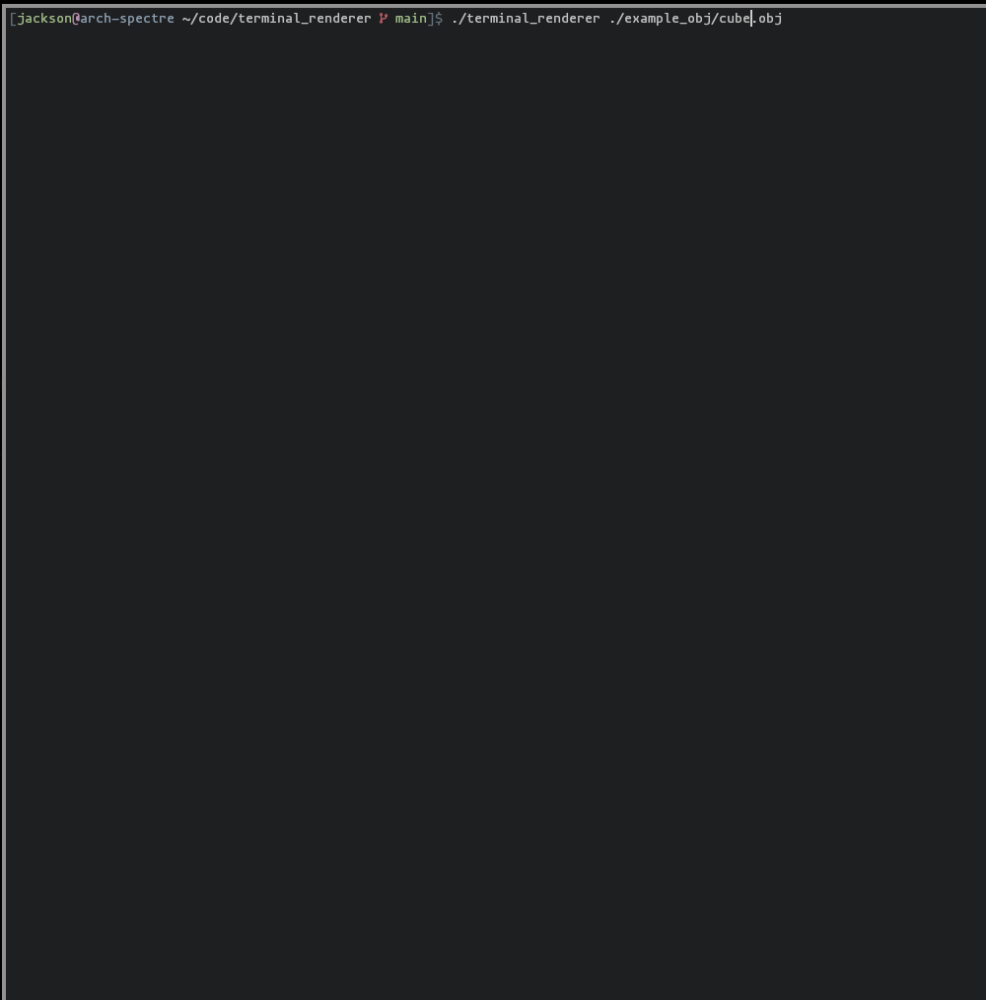
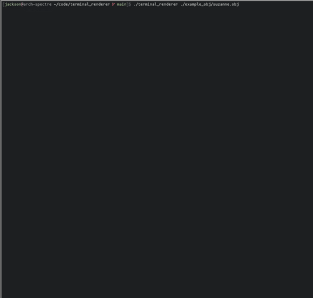

# Terminal Renderer
A small rust program that is able to render some `.obj` files in your own terminal. Single-threaded and based off my original [wireframe-cli](https://github.com/jumpyjacko/wireframe-cli) project. This renders with faces (with some caveats) and uses a small character set for the shading of the faces.

## Caveats
- Single threaded
- The Barycentric Co-ordinates math for face drawing is iffy and causes lines for each triangle
- Object files must be triangulated, this program does not render quads

## How to use
```./terminal_renderer <path-to-obj-file>```

## How to build
Use `cargo build --release`.

## Gallery
### Cube


### Suzanne

